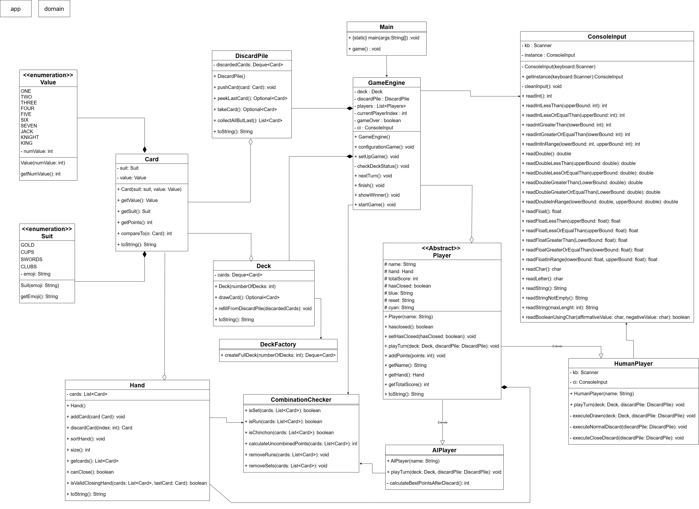

# CHINCHÓN 🎮

Juego de cartas español programado en Java.

## Objetivo 🚩

Ser el jugador con menos puntos al final de la partida, formando combinaciones de cartas o sacando un chinchón.

## Como se juega 🕹️

Primero el usuario debe configurar el juego según:
  - El número de jugadores en total (2 - 5)
  - Cuántos de esos jugadores son IAs 
  - Cuántas barajas quieren para jugar (1 o 2)
  - Cómo se llaman los jugadores

Después se reparten 7 cartas a cada jugador y se empieza la partida.

La partida se desarrolla por turnos y rondas. En cada turno, el jugador, ya sea humano o IA, debe decidir diferentes jugadas segun la fase del juego en la que esté:
  1. **Fase de robo**: El jugador debe elegir entre robar la carta superior del Mazo (desconocida) o la última carta de la Pila de Descartes (visible).
  2. **Fase de Evaluación**: El jugador añade la carta a su mano (teniendo temporalmente 8 cartas) y busca combinaciones (tríos, escaleras o chinchón).
  3. **Fase de Cierre o Descarte**:
       - Si el jugador logra combinar sus cartas de forma que los puntos no combinados sean iguales o
         inferiores a 3 y las combinaciones sean válidas, puede elegir Cerrar.
       - Si no puede o no quiere cerrar, debe Descartar una carta en la pila de descartes, volviendo a tener 7
         cartas y cediendo el turno.

Cuando uno de los jugadores cierre la partida, se contarán todos los puntos y el que tenga la menor cantidad de puntos será el ganador.

## Reglas 📜

- No se puede cerrar la partida en la primera ronda. Todos los jugadores deben jugar al menos 1 vez.
- Las combinaciones válidas son:
    - Trios: 3 cartas del mismo valor
    - Escaleras: 3 o más cartas del mismo palo en orden consecutivo
    - Chinchón: 7 cartas del mismo palo en orden consecutivo
- La puntuación se consigue sumando el valor de las cartas no combinadas
- Si un jugador consigue un chinchón, gana automáticamente con -10 puntos
- Cuando uno de los jugadores llega a los 100 puntos, se cierra automáticamente la partida y se anuncia al ganador

## Clases 📑

### Paquete app

**>> Main**

Punto de entrada principal de la aplicación del juego del Chinchón. Esta clase se encarga de arrancar el entorno del programa y ceder el control al motor del juego.

[Ver Main](src/app/Main.java)

**>> GameEngine**

Motor principal que controla el flujo de la partida.

[Ver GameEngine](src/app/GameEngine.java)

**>> ConsoleInput**

Clase de utilidad para la gestión de la entrada de datos por consola. Implementa el patrón Singleton para asegurar una única instancia de lectura en toda la aplicación y proporciona métodos validados para leer diferentes tipos de datos, garantizando que el programa no se interrumpa por entradas inválidas.

[Ver ConsoleInput](src/app/ConsoleInput.java)

### Paquete domain

**>> Player**

Clase abstracta que representa a un jugador en la partida. Define los atributos comunes como el nombre, la mano y la puntuación, y establece el contrato para el comportamiento del turno.

[Ver Player](src/domain/Player.java)

**>> HumanPLayer**

Representa a un jugador controlado por un humano.

[Ver HumanPlayer](src/domain/HumanPlayer.java)

**>> AIPlayer**

Representa a un jugador controlado por una IA

[Ver IAPlayer](src/domain/AIPlayer.java)

**>> Card**

Representa una carta individual de la baraja española utilizada en el juego del Chinchón. Cada carta consta de un palo y un valor. Esta clase implementa Comparable para permitir la ordenación automática de la mano del jugador.

[Ver Card](src/domain/Card.java)

**>> Deck**

Gestiona el mazo principal de cartas de la partida. Se encarga de suministrar cartas a los jugadores y de recargarse cuando se agota. Utiliza una estructura de datos Deque para un comportamiento de pila (LIFO).

[Ver Deck](src/domain/Deck.java)

**>> DeckFactory**

Factoría encargada de la creación y configuración inicial del mazo de cartas. Esta clase centraliza la lógica para generar barajas completas mezcladas y listas para jugar.

[Ver DeckFactory](src/domain/DeckFactory.java)

**>> Hand**

Representa la mano de un jugador en el juego del Chinchón. Gestiona un conjunto de 7 cartas (u 8 durante el turno) y contiene la lógica para organizar combinaciones (escaleras o grupos) y calcular puntos.

[Ver Hand](src/domain/Hand.java)

**>> DiscardPile**

Representa el montón de cartas descartadas boca arriba en la mesa. Los jugadores pueden interactuar con esta pila robando la última carta descartada o añadiendo una nueva al finalizar su turno.

[Ver DiscardPile](src/domain/DiscardPile.java)

**>> CombinationChecker**

Clase para detectar combinaciones válidas en una mano. Se encarga de identificar grupos de cartas iguales (Sets) y escaleras (Runs).

[Ver CombinationChecker](src/domain/CombinationChecker.java)

**>> Suit**

Representa los cuatro palos de la baraja española utilizados en el juego del Chinchón. Los palos disponibles son Oros, Copas, Espadas y Bastos. Cada palo tiene asociado un emoji para facilitar su visualización en la consola.

[Ver Suit](src/domain/Suit.java)

**>> Value**

Representa los valores numéricos de las cartas en la baraja española para el Chinchón. Incluye los números del 1 al 7 y las figuras (Sota, Caballo y Rey).
Según las reglas del juego:
- Los números 8 y 9 no se utilizan.
- Las figuras tienen un valor de 10, 11 y 12 puntos respectivamente.

[Ver Value](src/domain/Value.java)

## Patrones de diseño 🎨

**Singleton**

Implementado en la clase ConsoleInput. Garantiza que solo exista una instancia del lector de consola y el Scanner en toda la aplicación, evitando conflictos de flujo de entrada (System.in) y optimizando el uso de recursos.

**Factory**

Utilizado en DeckFactory. Centraliza la lógica de creación de la baraja española, abstrayendo al resto del sistema de la complejidad de instanciar cada carta con su palo y valor correspondiente, permitiendo además generar mazos simples o dobles fácilmente.

## Pruebas 🎲

### De caja blanca

- **Lógica de Combinaciones:** Me aseguré de que los algoritmos de la clase CombinationChecker no dejaran cabos sueltos. Por ejemplo, en las escaleras, comprobé que el código revisa paso a paso que todas las cartas sean del mismo palo y que los números vayan uno detrás de otro sin saltos.
  
- **Inteligencia Artificial:** Comprobé paso a paso cómo la IA toma sus decisiones. Me aseguré de que realmente compare todas sus cartas antes de descartar y que siempre elija la opción que le deje menos puntos, confirmando que el flujo del algoritmo es lógico y eficiente.

### De caja negra

- **Entrada de Datos:** Probé el sistema metiendo datos que no tienen sentido para ver cómo reaccionaba. Por ejemplo, intenté poner letras donde pedía números de jugadores, puse que quería jugar con 5 barajas o cuando pregunta si quieres robar del [M]azo o del [D]escarte escribi la letra A. El resultado fue que el programa aguantó perfectamente; en lugar de cerrarse con un error, se dio cuenta del fallo, me avisó y me pidió el dato otra vez.

- **Flujo del Turno:** Verifiqué que el ciclo de juego fuera fluido. Si robas una carta, aparece en tu mano; si descartas, se va a la pila. Comprobé que el juego hace exactamente lo que el usuario espera que pase en cada paso.

### Unitarias

Se han realizado test para comprobar la correcta funcionalidad de los metodos de CombinationChecker. Comprobando los tríos, las escaleras, el chinchon y los puntos combinados y sin combinar. 

[Ver Test](src/test/CombinationCheckerTest.java)

## UML

